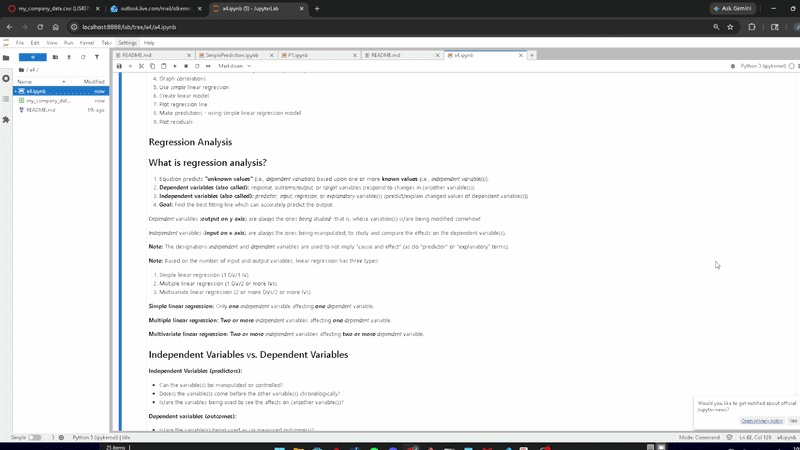
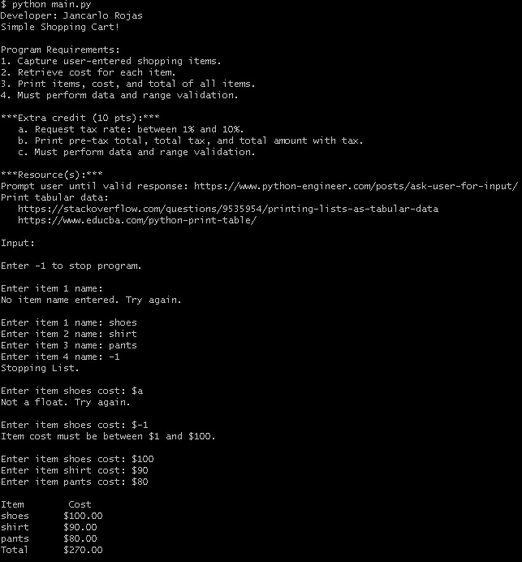
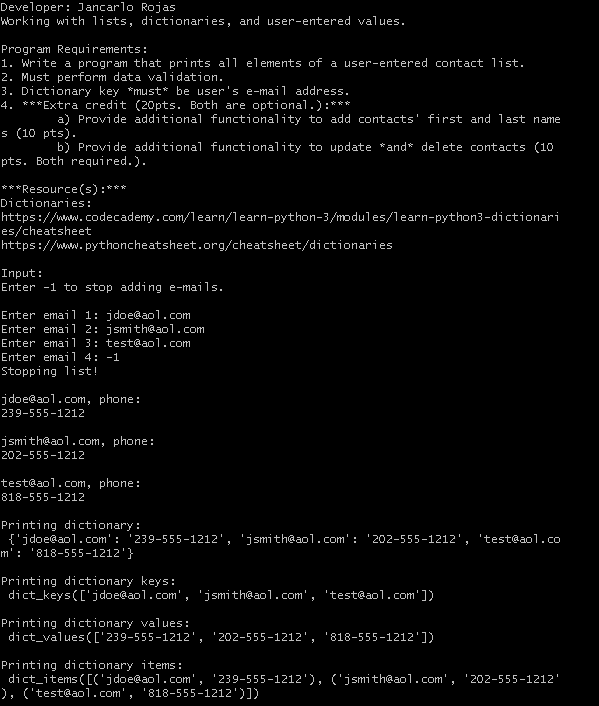
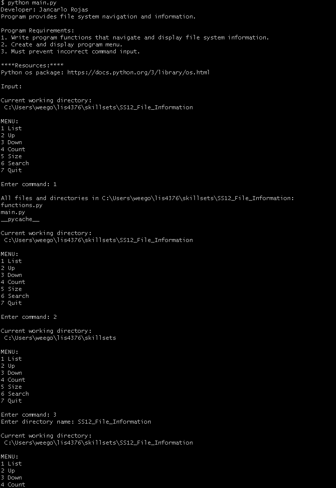
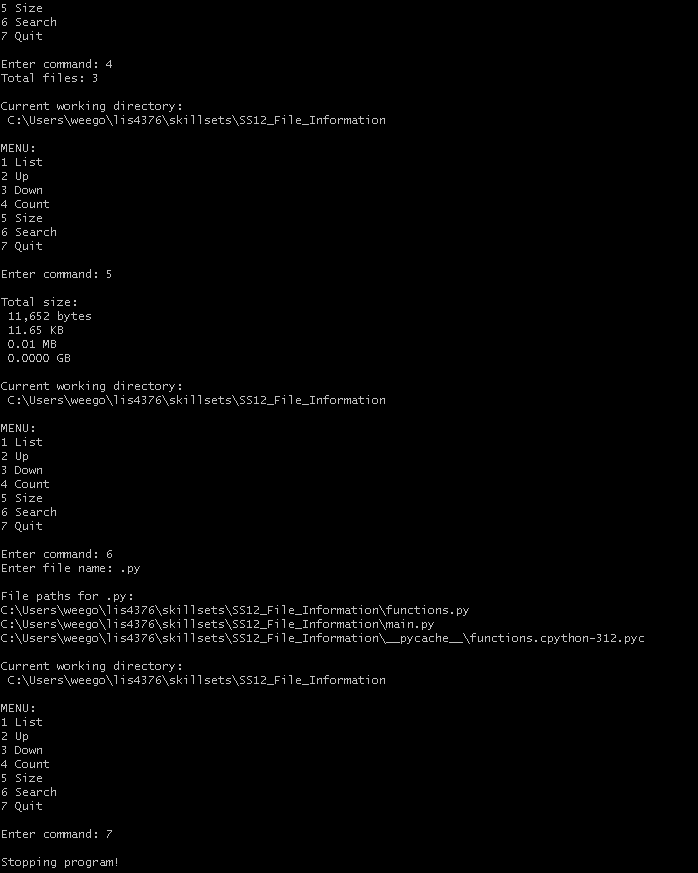

# LIS476 - Artificial Intelligence Applications

## Jancarlo Rojas

### Assignment 4 Requirements:

- Skillsets 10-12
- Develop A4 IPYNB
- Linear Regression and predictive analysis

---

*A4 Gif*:

---

*Files*:

- [a4.ipynb](/a4/a4.ipynb)
- [my_company_data.csv](/a4/my_company_data.csv)

#### Assignment Screenshots:

*Skillsets 10-12*:

- [SS10_Simple_Shopping](/skillsets/SS10_Simple_Shopping)

- [SS11_lists_and_dictionaries_dv](/skillsets/SS11_lists_and_dictionaries_dv)

- [SS12_File_Information](/skillsets/SS12_File_Information)

