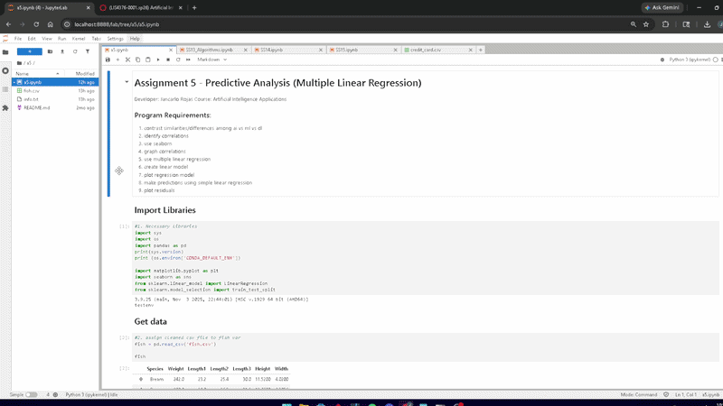
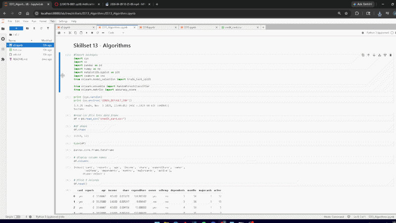
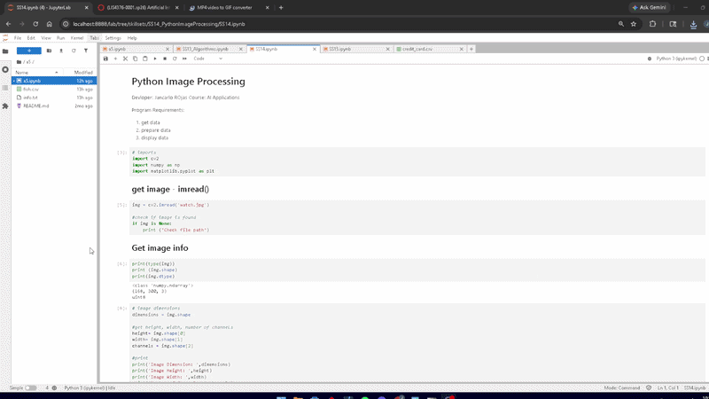
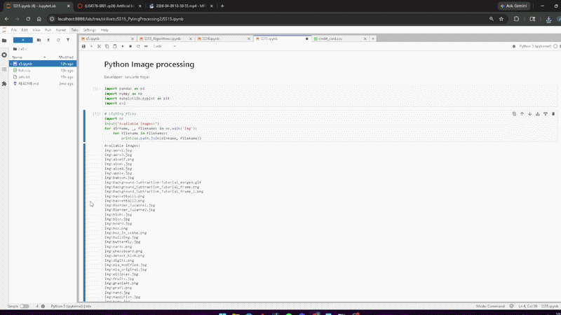

# LIS476 - Artificial Intelligence Applications

## Jancarlo Rojas

### Assignment 5 Requirements:

- Skillsets 13-15
- Developed A5 IPYNB
- Multiple Linear Regression
- Image Analysis with openCV

---

*A5 Gif*:

---

*Files*:

- [A5.ipynb](/a5/A5.ipynb)

#### Assignment Screenshots:

*Skillsets 13-15*:

- [SS13](../skillsets/SS13_Algorithms)  

- [SS14](../skillsets/SS14_PythonImageProcessing)  

- [SS15](../skillsets/SS15_PyImgProcessing2)  

