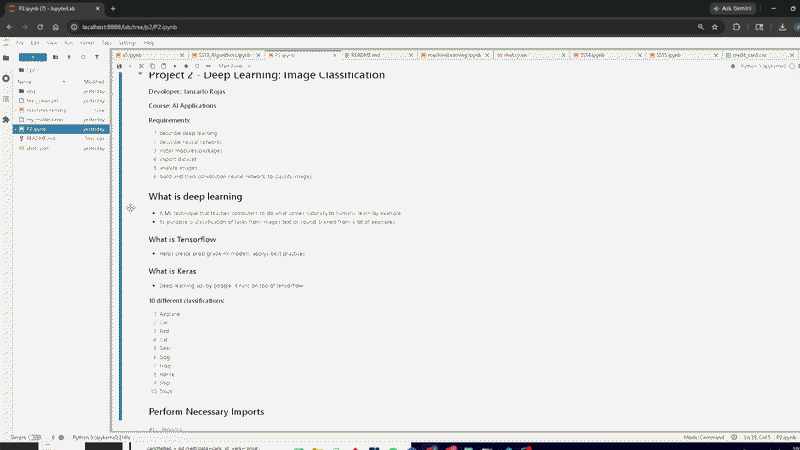
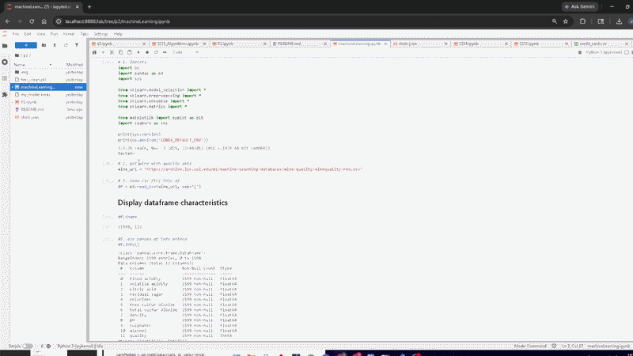

# LIS476

## Jancarlo Rojas

### Project 2 Requirements:
1. Reverse Engineer P2
2. Reverse Engineer In Class Excersize
3. Prediction Models
4. Train and Assess Data

#### Assignment Screenshots:

*PUT DESCRIPTIONS OF SS HERE:
- [P2](../p2/P2.ipynb)  

- [P2](../p2/machineLearning.ipynb)  

